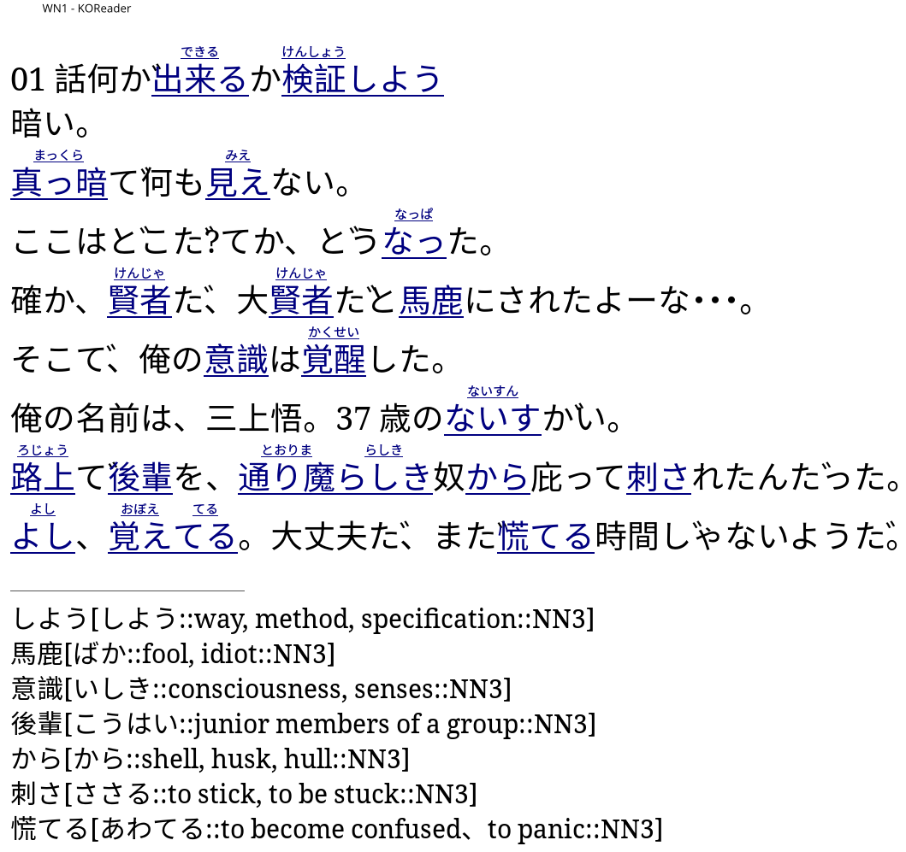

# jdpub

jdpub annotates a source document with definitions for difficult vocabulary
words to make reading easier.

jdpub currently only supports annotating documents for the Japanese language.

> [!WARNING]  
> This software is version `0.6.1`, expect configuration and usage to change.
> The alpha release exists to provide the tool as early as possible.

## Usage

A web view for jdpub is currently in development. Until then, refer to the CLI:

```
Annotate documents with readings and definitions

Usage: jdpub [OPTIONS] [INPUT]...

Arguments:
  [INPUT]...  Input chapters or book files

Options:
  -o, --output <OUTPUT>     Output file
  -c, --config <CONFIG>     Additional configuration file, parsed first
  -d, --debug               Debug flag
  -v, --verbose             Verbose flag
      --do-not-use-builtin  Skip built-in configurations
  -h, --help                Print help
  -V, --version             Print version
```

Example usage:

- Parsing a website: `jdpub https://hachha.dev/blog/jdpub -o jdpub.epub`
- Parsing a file:
  `curl https://hachha.dev/blog/jdpub -o jdpub.html && jdpub jdpub.html -o jdpub.epub`

## Motivation

This software was created to support reading more advanced material on an
e-reader as opposed to relying on other existing tools or services like
[yomitan](https://yomitan.wiki/) or [LingQ](https://www.lingq.com/) that require
a phone or pc. Additional motivation for the initial release can be read
[here](https://hachha.dev/blog/jdpub). jdpub supports fetching and parsing
webpages with various parse rules for navigating elements.

jdpub has the following goals:

- [x] Add dictionary tooltips for the Japanese language
- [x] Add furigana annotations for the Japanese language
- [x] Support custom parsing rules from the source document
- [x] Import from HTML
- [x] Import from EPUB
- [ ] Import from plaintext
- [x] Export to HTML
- [x] Export to EPUB
- [ ] Export to plaintext
- [ ] Provide a web-interface for client-side conversion (WASM)
- [ ] Provide more options for adding additional metadata to exported EPUBs
- [ ] Provide a sane default `styles.css`
- [ ] Image support
- [ ] Additional dictionary support
- [x] Support multiple configuration files
- [ ] Improve configuration merging support
- [ ] Support caching fetched HTML files

jdpub explicitly has the following non-goals:

- jdpub is not a reader.
- jdpub is not designed for document conversion, use
  [calibre](https://github.com/kovidgoyal/calibre) or other software.

While jdpub is currently only designed to support Japanese, it could be easily
extended to support additional languages. The Japanese writing system is
typically more complex than western writing, so techniques to tokenize the words
and lookup definitions with respect to conjugations is itself more complex. For
languages like English that can be tokenized solely by whitespace, the results
should be better.

## Software Support

jdpub adds
[popup tooltips](https://help.apple.com/itc/booksassetguide/en.lproj/itccf8ecf5c8.html)
to text that are supported by various e-readers. Popup tooltips work by adding
the `epub:type="noteref"` and `epub:type="footnote"` attributes to XHTML anchors
and asides, respectfully. Compatibility has been tested on the following
readers:

- Koreader (enable `Show footnotes in popup`)
- Neoreader



## References

- [Apple popup tooltips](https://help.apple.com/itc/booksassetguide/en.lproj/itccf8ecf5c8.html)
- [HTML vs XHTML](https://software.grok.lsu.edu/Article.aspx?articleid=6900)
- [Usability of footnotes](https://shkspr.mobi/blog/2020/07/usability-of-footnotes/)
- [iBook support](https://gist.github.com/NickBarreto/9811005)

## Installation

```bash
mise update-cache
cargo install jdpub -F jp
```

`jmdict-fast` is used for Japanese word lookup with the `jp` feature, but may
require a fast internet connection to build as-is.
